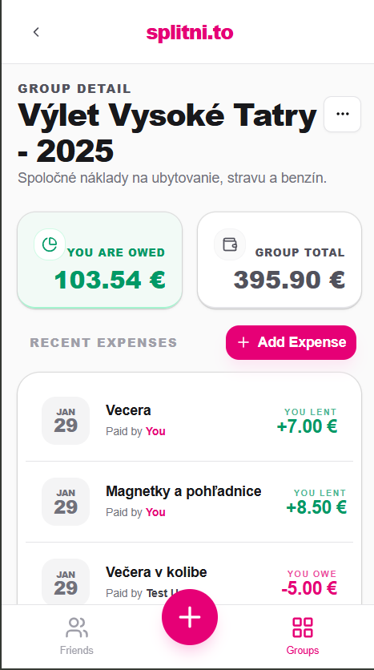
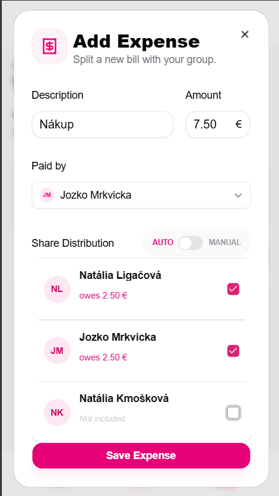
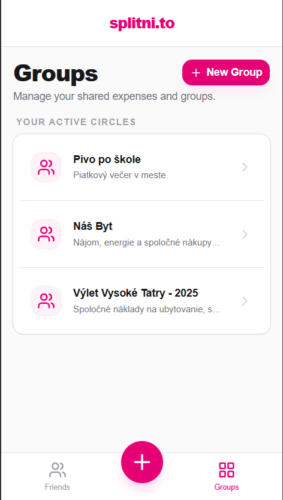
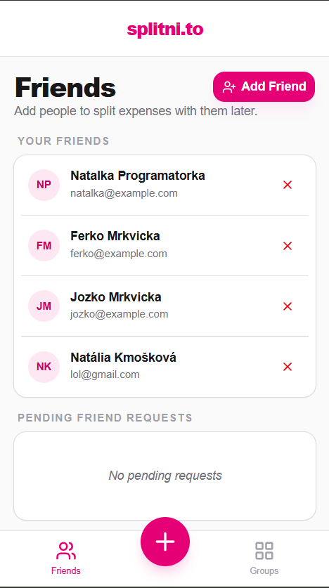

# Splitni.to

Splitni.to is a simple application for splitting shared expenses between groups of people. It helps friends, roommates, or travel groups easily track who paid for what and automatically calculate how much each person owes.

The goal of the project is to make group expense tracking quick, transparent, and easy to use.

## Features

- Add friends
- Create a group of participants
- Add shared expenses
- Automatically calculate balances
- See who owes whom

## Screenshots

<table>
  <tr>
    <td align="center"><b>Group Detail</b></td>
    <td align="center"><b>Add Expense</b></td>
    <td align="center"><b>Groups</b></td>
    <td align="center"><b>Friends</b></td>
  </tr>
  <tr>
    <td></td>
    <td></td>
    <td></td>
    <td></td>
  </tr>
</table>

## Tech Stack

Splitni.to is built using the following technologies:

### Frontend
- React

### Backend
- Go
- PostgreSQL

### Infrastructure
- Docker

## Running the Project

The easiest way to run the application is using Docker.

### 1. Clone the repository

```
git clone https://github.com/nataalka/splitni-to.git
cd splitni-to
```

### 2. Create configuration file

Copy the example configuration file and create your own:

```
cp backend/config/splitni-to.yaml.example backend/config/splitni-to.yaml
```

Then open splitni-to.yaml and set your JWT secret.

### 3. Start the application

```
docker-compose up
```

### 4. Open the application

Open the application in your browser and start by creating an account.

## Project Structure
```
splitni-to/
├── backend/                    # Go backend
│ └── config/
│   └── splitni-to.yaml.example # Example configuration file
├── frontend/                   # React frontend
├── docker-compose.yml          # Container orchestration
└── README.md
```

## Future Improvements

Planned improvements for the project include:

- Support for multiple currencies

- Smarter logic for calculating debts between participants

- Better UI/UX for expense management